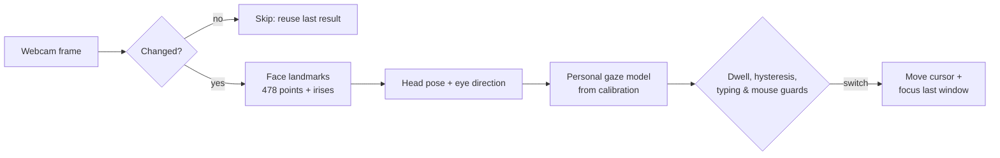

<p align="center">
  
</p>

<h1 align="center">Eye Tracker</h1>

<p align="center">
  Look at a monitor. Your cursor and keyboard focus follow.<br>
  Any webcam, offline by default, on Windows, macOS and Linux.
</p>

<p align="center">
  <a href="https://github.com/bugraskl/eye-tracker/actions/workflows/ci.yml"></a>
  <a href="https://github.com/bugraskl/eye-tracker/releases"></a>
  <a href="docs/platform-support.md"></a>
  <a href="docs/privacy.md"></a>
  <a href="LICENSE"></a>
</p>

<p align="center">
  <a href="https://bugraskl.github.io/eye-tracker/"><b>Website</b></a> · <b>English</b> · <a href="README.tr.md">Türkçe</a>
</p>

<p align="center">
  
</p>

> **This is a fork** of [bugraskl/eye-tracker](https://github.com/bugraskl/eye-tracker). It adds
> [window focus](docs/windows.md) on macOS (the window you look at gets the keyboard focus) and a
> moving-dot stage in the [calibration](docs/calibration.md#the-moving-dot). The downloads
> below are upstream's builds and do not include these features, so build from source:
> [building](docs/building.md).

## Why Eye Tracker

With two or more monitors, you look at the screen you want to work on and then still have to drag the
mouse there and click before you can type. Eye Tracker removes that step. It watches your head and
eyes through the webcam you already have and moves the cursor, and keyboard focus, to the monitor you
are looking at. Your hands stay on the keyboard.

It is an open-source, cross-platform take on the idea behind [Glance Switch](https://glanceswitch.com/),
with extras for privacy and presence: it locks your computer when you walk away, can cover the
screen when someone looks over your shoulder (opt-in), and never sends a single byte over the
network.

## Features

| | Feature | What it does |
|---|---|---|
| 👀 | **Glance to switch** | Look at another monitor for 0.3 s and the cursor lands there, where you left it last time. |
| ⌨️ | **Keyboard focus follows** | The last window you used on that monitor gets focus, without a synthetic click. |
| 🧠 | **Head pose + iris fusion** | 478 face landmarks, including both irises, not just head direction. Works with glasses. |
| 🛡️ | **No accidental switches** | Dwell time, hysteresis at the bezels, typing and mouse grace periods, and glances at your phone or desk are ignored. |
| 📖 | **Reading-aware** | Copying from a document on the other screen? Focus stays in your editor while you read. |
| 🪟 | **Split-pane focus** (experimental) | Off by default. Look at another pane of a tmux, WezTerm or Windows Terminal window and it gets the keyboard focus (the cursor follows, to where you left it in that pane); panes too small for your calibration's accuracy are left alone. Opt-in on Windows: sessions side by side in the Claude desktop app, or a conversation and its side chat in the ChatGPT (and Codex) desktop app, with the focus in the message box of the one you look at ([details](docs/panes.md)). |
| 🪟 | **Window focus** (experimental, macOS, this fork) | Off by default. Look at a window on the monitor you are on and, after 0.5 s, it gets the keyboard focus and comes forward, alone and not with all windows of its app. Only windows large enough for your calibration's accuracy take part, and it pauses while your head is outside the range you calibrated in ([details](docs/windows.md)). |
| 🔴 | **Moving-dot calibration** (this fork) | After the dots, a dot moves over each monitor for 40 s while you follow it with your eyes and may move your head. This gives the model frames from many head positions. In one test session with head movement, the mean error was 288 px, against 357 px with the earlier calibration ([details](docs/calibration.md#the-moving-dot)). |
| 🎯 | **Learns as you work** | Every time you move the mouse somewhere and stop, the calibration gets a little better. |
| 🚶 | **Walk-away lock** | No face and no input for 45 s: lock and/or displays off, announced by a 10 s countdown during the last seconds. Displays wake when you return. Until the setup assistant is finished, it only shows a notification. |
| 🙈 | **Privacy mode** | One hotkey releases the camera completely; the webcam light goes out. It stays on after a restart or an update until you turn it off. |
| 👥 | **Shoulder guard** | Opt-in (**Settings → Presence & privacy**): a second face behind you for 2 s gets a privacy curtain, a notification or a lock. |
| 📞 | **Plays nice with calls** | Releases the camera automatically on Windows and Linux when Teams, Zoom or another app needs it. On macOS, add your call apps to **Pause while these apps run**. |
| 🔋 | **Tiny CPU footprint** | About 0.5 % CPU on an 8-core desktop, thanks to an adaptive frame rate and a motion gate that skips unchanged frames ([measured](#performance)). |
| 🖥️ | **Any layout** | Two, three or more monitors, side by side, stacked, or a laptop below. One calibration per desk setup. |
| 🚀 | **Starts with your computer** | Optional start at login on all three platforms, in the background. |

Walk-away lock and the shoulder guard need the camera: they pause while tracking is paused, in
privacy mode, during calibration and while another app has the camera.

## Download

| Platform | Package | |
|---|---|---|
| **Windows** 10/11 x64 | Installer `.exe` or portable `.zip` | [Download](https://github.com/bugraskl/eye-tracker/releases/latest) |
| **macOS** 14+ Apple silicon | `.dmg` | [Download](https://github.com/bugraskl/eye-tracker/releases/latest) |
| **Linux** x86_64 | `.AppImage` or `.tar.gz` | [Download](https://github.com/bugraskl/eye-tracker/releases/latest) |

Every release ships `SHA256SUMS.txt` and GitHub build-provenance attestations. Builds are not
code-signed yet; see [platform notes](docs/platform-support.md) for the one-time Gatekeeper and
SmartScreen steps. The portable ZIP keeps its settings in your user profile like the installed app;
start it with `--config-dir FOLDER` to keep everything in a folder of your choice.

**Updating.** On Windows, an installed copy can update itself: turn on **Settings → General → Updates**
and it checks GitHub once a day, tells you about a new version and installs it when you agree
(**Check for updates…** in the tray menu works with that off). It is off by default because it is the
only thing that uses the network; [what it sends](docs/privacy.md#the-update-check-opt-in). Elsewhere,
take new versions from the releases page.

## Quick start

1. Install and start **Eye Tracker**. An eye icon appears in the tray (menu bar on macOS); click
   it for the menu, or right-click it on Linux. Windows 11 may keep it behind **^** on the
   taskbar.
2. Follow the short setup assistant: pick your camera, grant permissions on macOS, choose what
   happens when you walk away. Until it is finished, walking away only shows a notification. (If
   Eye Tracker first starts at sign-in, the assistant is offered as a notification; you can also
   open it with **Run setup assistant…** under Settings → General.)
3. **Calibrate**: look at the dots as they appear, about 15 seconds per monitor, then follow
   a moving dot for 40 seconds per monitor. ([Calibration guide](docs/calibration.md)) With one monitor there is nothing to switch
   between, and no calibration is needed, unless you use window focus.
4. Work normally. Look at the other monitor and start typing.

Default hotkeys:

| Action | Windows | macOS | Linux (X11) |
|---|---|---|---|
| Pause / resume tracking | `Ctrl+Alt+Win+T` | `⌃⌥⌘T` | `Ctrl+Alt+Super+T` |
| Privacy mode (camera off) | `Ctrl+Alt+Win+P` | `⌃⌥⌘P` | `Ctrl+Alt+Super+P` |
| Calibrate | `Ctrl+Alt+Win+C` | `⌃⌥⌘C` | `Ctrl+Alt+Super+C` |

The defaults avoid combinations that type characters on keyboards with AltGr (Ctrl+Alt+T is `₺` on
Turkish Q, for example), the ⌃⌥ shortcuts of Rectangle and Magnet on macOS, and on Linux the
Alt+Shift and Ctrl+Shift keyboard-layout switches and the Ctrl+Alt+Shift shortcuts of JetBrains IDEs
and VS Code. You can change them in **Settings → Hotkeys**; a combination that another app already
uses, or that types a character on one of your keyboard layouts, is reported as unavailable. The
pause and privacy hotkeys confirm with a short notification which way they switched. Every other
option is listed in the [configuration reference](docs/configuration.md).

## How it works



- **Vision.** MediaPipe's face-landmark network runs through OpenCV's DNN module. The MediaPipe
  runtime is not used, because it contains a telemetry uploader ([why](docs/privacy.md#why-not-the-mediapipe-runtime)).
- **Personal model.** Calibration fits a small regression from your head angles and iris positions
  to screen positions. Its accuracy is graded honestly with leave-one-point-out cross-validation.
- **Decision.** A switch needs a steady look past the bezel for 0.3 s, and is held back while you type,
  use the mouse or read the other screen during typing.
- **Action.** The cursor returns to where you left it on that monitor, and the last window you used
  there gets keyboard focus. With [window focus](docs/windows.md) on (macOS), the window you look
  at on that monitor gets it too.

Deeper dive: [architecture](docs/architecture.md).

## Privacy

| Promise | Verified by |
|---|---|
| No network access by default: no telemetry, no accounts. The one thing that can use the network is the update check, which you turn on yourself (Windows, off by default): one HTTPS request a day to `api.github.com` that carries no identifier. | A source scan fails CI on networking code, with that single reviewed exception. Every release build, and every pull request that changes the packaging or the dependencies, is scanned too: each bundled native library and Python module. |
| Camera frames are analysed in memory and never saved. | The source scan fails CI on OpenCV's image and video writers (`imwrite`, `imencode`, `VideoWriter`); anything else is left to code review. |
| Only numbers are stored: head angles, iris ratios, screen points. | `calibration.json` is plain JSON. |
| Privacy mode, pause and a locked screen release the camera. | The webcam light goes out. |
| Typing is detected from the OS idle timer, never by reading keys. | [`engine/input_state.py`](src/eye_tracker/engine/input_state.py) |

Details: [privacy](docs/privacy.md).

## Performance

<!-- PERF:BEGIN -->
Measured during normal work with tracking on: Windows 11, AMD Ryzen 7 3700X (8 cores, 16 threads),
Logitech C920 at 640×480, Balanced profile, the shipped `EyeTracker.exe`. CPU figures include camera
capture and the tray app.

| | Measured |
|---|---|
| CPU, whole machine | **0.55 %** on average (1.7 % peak) |
| CPU, one core | 9 % on average |
| Face analysis per frame | 11 ms (median), 12 ms (95th percentile) |
| Memory | about 200 MB |
<!-- PERF:END -->

Run `eye-tracker bench` to measure CPU use and latency on your own machine.

With the default **Balanced** profile Eye Tracker analyses 1 to 12 frames per second depending on
what is happening (24 while calibrating or while the camera preview is open), and skips frames in
which nothing moved. **Eco** uses 0.5 to 8 (15) for the lowest CPU use, **Responsive** 1 to 20 (30)
for the fastest reactions; choose under **Settings → Camera & performance**.

## Command line

The examples use `eye-tracker`. What to type depends on how you installed Eye Tracker:

| Installed from | Command |
|---|---|
| Windows installer | `eye-tracker` in a new terminal (PATH option unticked: `.\eye-tracker.exe` in `%LOCALAPPDATA%\Programs\Eye Tracker`) |
| Windows portable ZIP | `.\eye-tracker-cli.exe` in the extracted folder |
| macOS | `"/Applications/Eye Tracker.app/Contents/MacOS/eye-tracker-cli"` |
| Linux AppImage | the AppImage file itself, e.g. `./EyeTracker-<version>-linux-x86_64.AppImage` |
| Linux tarball | `./eye-tracker/eye-tracker` |
| From source | `uv run eye-tracker` |

`eye-tracker doctor` shows the command of your copy (*command_line*), and so do the app's own hints.

```bash
eye-tracker                     # start the tray app
eye-tracker calibrate           # calibrate now (or ask the running app to)
eye-tracker doctor              # diagnostics: camera, monitors, permissions, features
eye-tracker bench               # measure CPU use and latency on this machine
eye-tracker ctl privacy-toggle  # control the running app: show, settings, pause, resume, toggle,
                                # privacy-on, privacy-off, privacy-toggle, calibrate, status, quit
eye-tracker autostart enable    # start at login (enable | disable | status)
eye-tracker reset --all         # forget calibrations and settings
```

On Windows, `eye-tracker` and `eye-tracker calibrate` start the app on its own and return at
once: closing the terminal does not end it.

`eye-tracker ctl` also lets you bind actions to your own keyboard shortcuts, for example on Wayland
where global hotkeys are not available. Bind the full command from the table: a shortcut bound to a
command that does not exist does nothing.

## Platform support

| | Windows | macOS | Linux X11 | Linux Wayland |
|---|:---:|:---:|:---:|:---:|
| Cursor follows gaze | ✅ | ✅ | ✅ | ⚠️ sway, Hyprland, or ydotool¹ |
| Keyboard focus follows | ✅ | ✅ | ✅ | ❌ |
| Walk-away lock, privacy mode, shoulder guard | ✅ | ✅ | ✅ | ✅² |
| Global hotkeys | ✅ | ✅ | ✅ | via `eye-tracker ctl` |

¹ Wayland does not let apps read the pointer position: the cursor lands in the middle of the
monitor instead of where you left it, and mouse use does not refine the calibration.

² Outside GNOME, Wayland does not report keyboard and mouse use: only the camera tells whether you
are there, and typing does not hold switching back.

Full matrix and per-platform notes: [platform support](docs/platform-support.md).

## Compared with Glance Switch

Glance Switch inspired this project. This comparison uses the features listed on
[glanceswitch.com](https://glanceswitch.com/) in October 2026.

| | Eye Tracker | Glance Switch |
|---|---|---|
| Platforms | Windows, macOS 14+ (Apple silicon; Intel from source), Linux | macOS 14+ (Apple silicon & Intel) |
| Price | Free, MIT licence | $14.99 one-time |
| Source code | Open | Closed |
| Network use | None by default; an update check only if you turn it on | Licence key check + daily update check |
| Tracking | Head pose + iris landmarks | Head pose (+ eye position for panes) |
| Split-pane focus in terminals and editors | Experimental: terminals, Claude and ChatGPT/Codex desktop apps | ✅ |
| Learns from your mouse use | ✅ | ✅ (from clicks) |
| Walk-away lock / displays off | ✅ | Not listed |
| Shoulder-surfer guard | ✅ | Not listed |
| Automatic camera hand-off to calls | ✅ Windows, Linux (app list on macOS) | Not listed |

## Run from source

Requires [uv](https://docs.astral.sh/uv/) (it fetches the right Python itself).

```bash
git clone https://github.com/bugraskl/eye-tracker.git
cd eye-tracker
uv sync
uv run eye-tracker
```

This is also the way to run Eye Tracker on an Intel Mac (macOS 14 or newer). On Linux, running
from source needs glibc 2.34 or newer (for the Qt wheels) and your distribution's `libxcb-cursor0`
(Debian/Ubuntu) or `xcb-util-cursor` (Fedora, Arch) package. Building installers yourself:
[building](docs/building.md).

## FAQ

<details>
<summary><b>Does it work with glasses?</b></summary>

Yes. Strong reflections can hide the irises; if the calibration grade is poor, tilt the camera or the
lamp slightly.
</details>

<details>
<summary><b>I have one monitor. Is this useful?</b></summary>

Switching needs two or more monitors, but walk-away lock, privacy mode and the shoulder guard work
with one. So does window focus on macOS, which needs a calibration.
</details>

<details>
<summary><b>Will it steal focus while I'm typing?</b></summary>

No. Nothing switches while you type (and for 2 s after), while you use the mouse (1.5 s), or while
you pause to read the other monitor during typing (6 s). All of these are adjustable.
</details>

<details>
<summary><b>What happens when I look at my phone?</b></summary>

Nothing switches. From your calibration Eye Tracker estimates where your head and eyes point
together, and a gaze that lands well below or beside every monitor (a phone, papers, the keyboard)
is ignored.
</details>

<details>
<summary><b>Does it record me?</b></summary>

No. Frames exist only in memory for a few milliseconds while they are analysed. Nothing is written to
disk or sent anywhere. See [privacy](docs/privacy.md).
</details>

<details>
<summary><b>Can I use an external webcam?</b></summary>

Yes, any webcam works. Place it where it stays, ideally centred above your monitors, and recalibrate
if you move it.
</details>

## Roadmap

- Split-pane focus in editors (VS Code and Cursor, JetBrains IDEs) and for tmux in a split Windows Terminal
- Signed and notarised builds
- Intel macOS builds
- Translations of the user interface

Ideas and bug reports are welcome in [issues](https://github.com/bugraskl/eye-tracker/issues).

## Contributing

Read [CONTRIBUTING.md](CONTRIBUTING.md). Accuracy reports from real desk setups, reproducible bug
reports with `eye-tracker doctor` output, and focused pull requests are the most valuable
contributions. Security or privacy problems: please follow [SECURITY.md](SECURITY.md).

If Eye Tracker saves you a few hundred mouse trips a day, consider **starring the repository**. It
helps other multi-monitor users find it.

## Acknowledgements

- [MediaPipe Face Landmarker](https://ai.google.dev/edge/mediapipe/solutions/vision/face_landmarker) model by Google (Apache-2.0)
- [YuNet](https://github.com/opencv/opencv_zoo/tree/main/models/face_detection_yunet) face detector (MIT)
- [OpenCV](https://opencv.org/) (Apache-2.0) and [Qt for Python](https://doc.qt.io/qtforpython-6/) (LGPLv3)

The model files, their licence texts and checksums are listed in
[NOTICE.md](src/eye_tracker/vision/models/NOTICE.md).

## License

[MIT](LICENSE)
