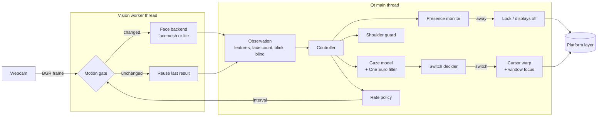
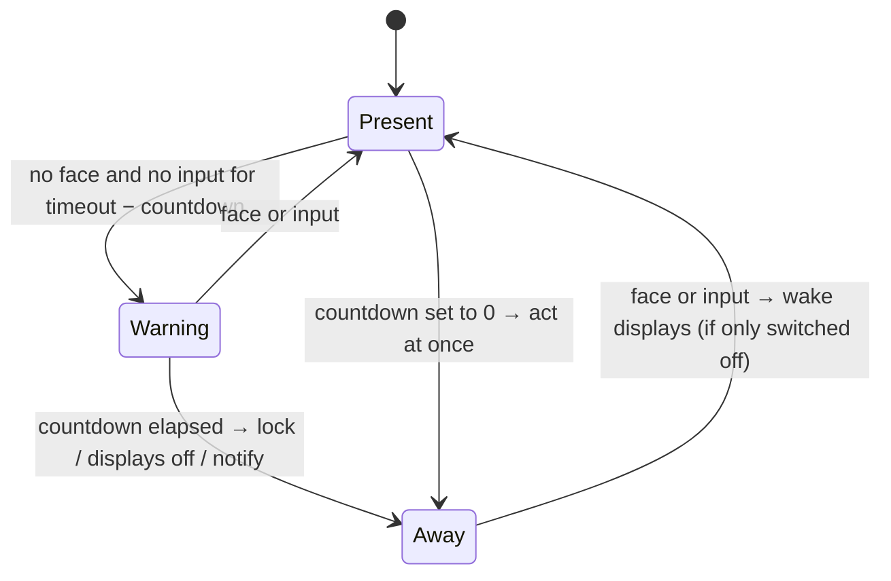

# Architecture

Eye Tracker is a small Qt tray application with a vision thread. This document describes how a
camera frame becomes a cursor jump, what runs on which thread, and why the code is split the way it
is.

## The pipeline



1. **Capture.** `vision/camera.py` opens the camera with the platform's native API (DirectShow,
   AVFoundation, V4L2) at 640×480, asks for MJPG and a small driver buffer, and only drops stale
   frames when the loop has been idle longer than a frame period.
2. **Motion gate.** `vision/motion.py` compares a 32×24 grey thumbnail of the frame, plus a
   thumbnail of the eye band, with the last analysed frame. If nothing moved, the previous result is
   reused and no neural network runs. A blink is never reused, and neither is a result the face
   backend has not settled on (see below): the picture stops changing as soon as the user sits
   still, and the gate would otherwise repeat biased features. The gate is off while the camera
   preview is open. The same thumbnail flags *blind* frames (lens covered, shutter closed, dark
   room) so they are treated as "cannot tell" rather than "nobody here".
3. **Face backend.** `vision/backends/`:
   - **facemesh** (default) runs MediaPipe's face-landmark network (478 points including both
     irises) with OpenCV's DNN module and fits the canonical face mesh with `solvePnP` for head
     pose. It tracks the face region from frame to frame. After a posture shift it runs the network
     again on the region the landmarks ask for (two to four inferences for that one frame), so the
     features are right on the first frame; until the region has caught up, the result counts as
     not settled. YuNet finds the face when tracking is lost, also rotated by ±45° for a strongly
     tilted head. Every 1.5 s (and 0.5 s after a face was found) one small YuNet detection checks
     whether a clearly larger or more central face is in view, so a poster or a colleague picked up
     while the user was away does not keep control once the user is back. Features: yaw, pitch,
     roll, head position, and the iris position inside each eye.
   - **lite** uses only YuNet's five landmarks (eyes, nose, mouth corners): head orientation
     without eye direction, for the lowest CPU use.

   The MediaPipe *runtime* is intentionally not used. Its native library contains a usage-logging
   uploader, and this app never touches the network (see [privacy.md](privacy.md)).
4. **Gaze model.** `gaze/model.py` maps the feature vector to a point on the virtual desktop with
   ridge regression on standardised features. Nonlinear terms (squares, pairwise products, cubes)
   are built only from the gaze-direction features (yaw, pitch, iris), never from head position or
   roll, so leaning back or sitting lower does not bend the fit. Degree and regularisation are
   chosen by leave-one-point-out cross-validation on the calibration data. The same fit yields a
   linear estimate of the combined gaze direction (head plus eyes); when it lies more than 0.2 × the
   nearest monitor's diagonal outside every monitor, the user is looking away (phone, desk), which
   suppresses switching. Monitors of different pixel density (a 4K panel next to a 1080p one) make
   that single linear estimate overshoot on the coarser monitor, so the calibration also records
   where the estimate places each monitor, and gaze near that place counts as on screen too. Models
   saved by older versions use a per-feature range test instead until they are recalibrated or
   refined by adaptive learning.
5. **Smoothing.** A One Euro filter (`gaze/filters.py`) removes webcam jitter while keeping
   deliberate head turns fast.
6. **Switch decision.** `engine/decision.py` turns the smoothed gaze into at most one switch; see
   [The switching rules](#the-switching-rules).
7. **Action.** The controller remembers the cursor position and focused window of the monitor being
   left, warps the cursor to the target monitor and gives keyboard focus to the last window used
   there. No synthetic clicks are ever sent.

8. **Window step (macOS, experimental).** After the switch decision, `controller.py` runs a second
   decider whose "panes" are the visible parts of the windows on the monitor the cursor is on
   (`panes/windows.py`, window list from `platform/macos.py`). It runs only when the monitor decider
   is content, when the head is inside the calibrated range (`windows.pause_off_range`, from the
   model's extrapolation of the head features) and when a calibration exists. A window that
   passes the size gate and the dwell gets the keyboard focus and comes forward alone, not all
   windows of its app; the cursor does not move. Pane focus then works inside that window.
   See [window focus](windows.md).

## The switching rules

A switch fires only when all of these hold:

| Rule | Default | Why |
|---|---|---|
| **Dwell.** The gaze has favoured the other monitor continuously | 300 ms | Quick glances do nothing. |
| **Hysteresis.** The gaze is clearly nearer the other monitor than the current one | 6 % of the monitor's shorter side | Jitter at the bezel cannot flip-flop. The margin also holds below and above the seam, where the keyboard usually is. |
| **Not looking away.** The combined gaze-direction estimate is on or near a monitor, and so is the smoothed gaze point | within 20 % and 35 % of the monitor's diagonal | Looking at a phone or the desk is ignored. |
| **Mouse grace.** No manual mouse movement recently | 1.5 s | The mouse always wins. |
| **Typing grace.** No keystroke recently | 2 s | Focus never moves in the middle of a sentence. |
| **Reading grace.** If you typed while looking at the other monitor (copying from it) | 6 s | Pausing to read the source document does not steal focus from the editor. |
| **Cooldown.** Time since the previous switch | 600 ms | No ping-pong. |

Typing is detected without a keyboard hook. The OS idle timer resets on any input; if it resets
while the cursor did not move, it was a key press (or a click or scroll). On macOS the idle time of
key events can be read directly. No key contents are ever observed.

## Presence and privacy states



The countdown is part of the timeout: with the defaults it starts after 35 s without face or input,
and the action runs at 45 s. Seeing the user cancels it, and so does keyboard or mouse input while
`presence.require_input_idle` is on (Wayland outside GNOME reports no input, so there only the
camera can). With a countdown of 0 the action runs without warning. Until the first-run setup is
finished, the lock and display-off actions only notify.

A frame that cannot be judged (camera off, privacy mode, calibration) freezes the timers instead of
counting as absence. A blind frame (lens covered, dark room) freezes them only when the blindness
began while the user was demonstrably there (face seen or input within 3 s), and then for at most
5 minutes without input; blindness that begins after the user left counts as absence.

Every detected face counts as the user. The shoulder guard (`engine/guard.py`) never decides
presence: it compares face boxes and cannot recognise faces, and a wrong "that is not the user"
would lock out someone sitting at their own desk. It only decides whether its reaction (curtain,
notification, lock) is still needed. It triggers after a second face has been in view for 2 s,
follows whose face is the user's by continuity of the face box (not by size, so a colleague leaning
in closer never becomes the user), keeps the curtain up while only the other person's face is left,
and clears once the user's face is the one in view again or the keyboard or mouse is used. While it
judges the user gone, two faces in view trigger it again, so a judgement that was wrong never
silences it.

The controller derives one tracking state from its flags, in this priority order:

`Privacy > Locked > Calibrating > Paused > Yielded > Away > Camera error > Needs calibration > Tracking`

The camera is released in Privacy, Locked, Paused and Yielded, so the webcam light is off. Privacy
mode is remembered across restarts (`privacy.remember_privacy_mode`), so the camera stays off until
the user turns it off. *Needs calibration* applies only where a calibration would change something:
with two or more monitors and switching turned on.

## Frame rate and CPU

The camera is never read faster than needed. `engine/scheduler.py` picks the analysis rate from the
situation:

| Situation | Eco | Balanced | Responsive |
|---|---:|---:|---:|
| A switch is pending or the gaze is moving | 8 fps | 12 fps | 20 fps |
| Idle, looking at the current monitor | 2 fps | 4 fps | 8 fps |
| Typing | 1 fps | 2 fps | 4 fps |
| No face | 1 fps | 2 fps | 3 fps |
| Away | 0.5 fps | 1 fps | 1 fps |
| Calibrating or preview open | 15 fps | 24 fps | 30 fps |

Most idle frames are then skipped by the motion gate, so a typical session analyses only a few
frames per second. `eye-tracker bench` measures the cost on your machine.

## Threads

| Thread | Owns | Talks to the rest via |
|---|---|---|
| Qt main thread | Controller, UI, gaze model, decisions, platform calls | Qt signals |
| Vision worker | Camera, motion gate, face backend | Queued Qt signals (observations, stats, preview frames) |
| Hotkey thread (Windows, X11) | `RegisterHotKey` message loop / `XGrabKey` event loop | Queued signal to the main thread |

The face backend is created, used and closed on the worker thread. Worker setters (`set_interval`,
`set_active`, …) are thread-safe and wake the loop.

## Calibration

`gaze/calibration.py` shows nine dots per monitor in a serpentine order. For each dot it waits
0.8 s for the eyes and head to settle, then collects samples for 1 s, skipping blinks and
unusable frames. A dot with too few samples is retried once and then skipped. The result is graded
by leave-one-point-out cross-validation: each dot is predicted by a model that never saw it.

After the dots, a moving-dot stage follows (`PURSUIT_S`, 40 s per monitor). The dot moves along a
Lissajous path inside the dots' margins while the user follows it with the eyes and may move the
head. Each frame is labelled with the dot's position `PURSUIT_LAG_S` (0.1 s) earlier, the first
0.5 s of a path is skipped, and the path is cut into 2 s segments that cross-validation hides one
at a time. `balance_pursuit_weights` gives the moving-dot samples together the weight of the dots.
The gaze error that the size gate uses comes from the dots only.

The calibration window (`ui/calibration_window.py`) pauses the dots while no face has been seen for
1.5 s. Walk-away detection and the shoulder guard are suspended while it is open, so it closes
itself after 60 s without a face, or after 2 minutes without a key press while it waits for one.

Calibrations are stored per monitor layout, backend and camera (`gaze/store.py`), so moving a
laptop between two docks switches between profiles instead of forcing a recalibration. Only numbers
are stored: feature vectors and target points, never images.

While you work, the app learns from natural mouse use: when you move the mouse to a spot and stop,
you are almost always looking at it. Those samples refine the model with a lower weight. Samples
that disagree with the model by more than a monitor are rejected rather than learned, and a drift
monitor suggests recalibrating when accuracy drops. At most `learning.max_samples` learned samples
are kept per profile; lowering the limit trims and refits every stored profile when it is next
used. On Wayland nothing is learned, because the pointer position cannot be read there.

## Coordinates

All screen coordinates are Qt global coordinates. On Windows and Linux/X11 the app disables Qt's
high-DPI scaling and is per-monitor DPI aware, so Qt coordinates equal native pixels. On macOS Qt
coordinates are Cocoa points, which is what Quartz and the Accessibility API use. No conversion
happens anywhere.

## Code map

```
src/eye_tracker/
  types.py            shared value types (Rect, Monitor, Observation, TrackingState)
  config.py           typed settings with validation and forgiving loading
  vision/             camera, motion gate, worker thread, face backends and models
  gaze/               gaze model, filters, calibration, calibration store, implicit learning
  engine/             decision, reading rule, presence, guard, scheduler, input tracking, controller
  panes/              split-pane focus (experimental): providers, worker thread, decision;
                      windows.py turns the window list into panes for window focus (macOS)
  platform/           Windows / macOS / Linux integration, autostart, global hotkeys
  ui/                 tray, settings, calibration window, overlays, wizard
  app.py, cli.py      application wiring and command line
  ipc.py              single instance and `eye-tracker ctl`
  diagnostics.py      `doctor` and `bench`
```

`gaze/` and `engine/` (except `controller.py`) import neither Qt nor OpenCV and take the current
time as an argument, so the logic that decides when to switch or lock is tested deterministically.
The same holds for `panes/decider.py`; the pane providers run the terminals' own command-line tools
on the pane worker's thread ([split-pane focus](panes.md)).
